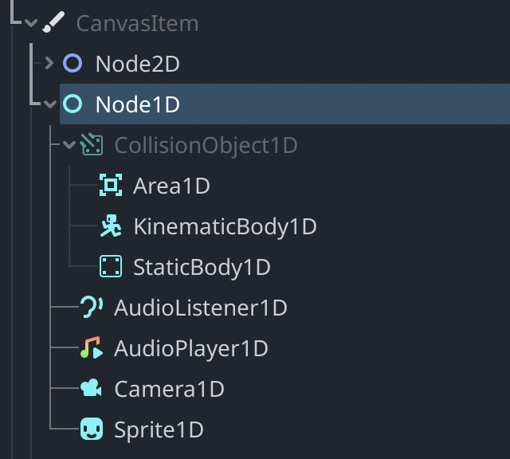

# Godot 1D

Node1D and other 1-dimensional node types for making 1D games in Godot.



Have you ever wanted to make 1D games in Godot?

...no? You say you haven't? Ok, then this module isn't for you.

For anyone who does want to make a 1D game, Node1D and other 1D nodes now
exist, just download this module and compile it with Godot!

Node1D is a
[`CanvasItem`](https://docs.godotengine.org/en/stable/classes/class_canvasitem.html)-derived
node, which means that it can exist in the same scene hierarchy as
Node2D and Control nodes and it will preserve positions etc. This
means that you can add 2D nodes as children of 1D nodes to have a
2D appearance with 1D game logic (1.5D...?) or you can make a 2D game
with a node that can only move left and right (why not just use a
Node2D and only change the X position? Good question). Node1D is also
integrated with CanvasItem editor, so you can move and scale it
with the 2D editor tools (trying to move up/down, scale up/down,
or rotate it just does nothing).

## Nodes

* `Node1D`: Base class for 1D nodes. Has a position, scale, and Z-index.
  * `Sprite1D`: 1D sprite that displays one row of pixels at a time. Each row is a frame.
  * `Camera1D`: 1D camera, allows specifying a thickness for how many pixels tall the world is.
  * `AudioListener1D`: Same as AudioListener2D but for 1D.
  * `AudioPlayer1D`: Same as AudioStreamPlayer2D but for 1D.
  * `CollisionObject1D`: Base class for 1D physics objects (abstract). Has a size.
    * `Area1D`: 1D area for physics detection.
    * `KinematicBody1D`: 1D kinematic body used for characters and other animated objects.
    * `StaticBody1D`: 1D physics body which is static and does not move.

The physics nodes are backed by a `PhysicsServer1D` singleton (not exposed).
It doesn't do any processing on its own, but it does all of the
heavy lifting when you move a node using `Area1D`'s `move`
method or `KinematicBody1D`'s `move_and_collide` method.

All classes are fully documented and have icons. The color is
Cyan to fit with the existing color pattern: Red is 3D,
[Purple is 2.5D](https://github.com/godotengine/godot-demo-projects/tree/master/misc/2.5d),
Blue is 2D, so if we continue subtracting hue we get to Cyan.
If Node4D ever exists, it would make sense to color it Yellow.

## Games using this 1D module

* Aaron's Lovely Morning by Moowool
  - Has 2D visuals, but all game logic is 1D.
  - Itch page: https://moowool.itch.io/aarons-lovely-morning (Windows, Mac, Linux, Web)
  - Source code: https://git.moowool.info/moowool/aarons-lovely-morning (GPLv3)

## Branches

* [`master`](https://github.com/aaronfranke/godot-1d)
    branch for a module for Godot 4.x (compiles into the engine).
* [`3.x`](https://github.com/aaronfranke/godot-1d/tree/3.x)
    branch for a module for Godot 3.x (compiles into the engine).

## Why?

You might be wondering, why? Why spend time making 1D
nodes if 1D games are basically pointless?

Are you sure that you need more spatial dimensions than left and right?
Keep in mind that you also have time at your disposal! And colors! And audio!
Plus you can always throw Sprite2D into your 1D game! You could make a rhythm
game with objects moving left and right. Maybe you could make a game
like the Google Chrome offline dinosaur without jumping?
**The possibilties are *quite limited!***

Besides, science isn't about why, it's about why not. Why are all of
these nodes 1 dimensional? Why not marry 2+ dimensional nodes if you
love them so much? In fact, why not invent a special 3D door that
won't hit you on the butt on the way out because you are fired!
Yes, you. Box your 3D stuff. Out the front door.

## Versions

This module is available for Godot 4.x (see the
[`master`](https://github.com/aaronfranke/godot-1d)
branch of this repo) and Godot 3.x (see the
[`3.x`](https://github.com/aaronfranke/godot-1d/tree/3.x)
branch of this repo), except that there is no AudioPlayer1D in 3.x because
there is no `get_camera_2d` in 3.x so I couldn't make AudioPlayer1D aware
of Camera1D and I didn't want to make a sub-optimal AudioPlayer1D
(you can use AudioStreamPlayer2D instead).

## 0D

Node0D is just Node. If you want Node0D, here's some GDScript:

```
const Node0D = Node
const AudioPlayer0D = AudioStreamPlayer
```

## License

This repo is free and open source software licensed under The Unlicense.
Credit and attribution is appreciated but not required.

Some parts of some files in this repository are derivative from Godot Engine
and therefore [its MIT license](https://godotengine.org/license) applies.
You must provide credit to Godot Engine by including its LICENSE.
This includes the icons, some of the docs, and some code in the Node1D
and Sprite1D classes, and most of the code in the AudioPlayer1D class.
Considering this repo is only usable in conjunction with Godot anyway,
this will not be a problem because you should already be crediting Godot.
